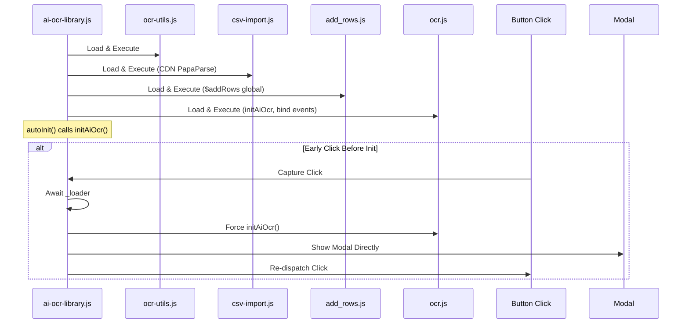
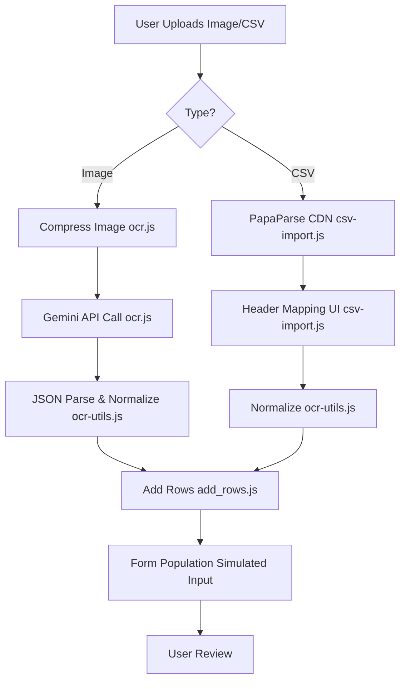

# AI OCR Purchase Order Assistant

This project is a web-based, serverless demonstration of an AI-powered Optical Character Recognition (OCR) tool for automating data entry in purchase order forms. Users upload images or CSV files, extract structured line-item data using the Google Gemini API, and automatically populate a web form. Everything runs entirely in the browser—no Node.js, bundlers, or server required.

## Features

- **AI-Powered OCR**: Extracts structured data from document images using Google Gemini API.
- **CSV Import with Mapping**: Upload CSV files, map headers to fields with live preview, normalize data, and add rows without OCR.
- **Dynamic Form Population**: Automatically adds and fills form rows with simulated human-like input for compatibility with legacy forms.
- **Self-Contained UI**: Injects modal, buttons, and styles dynamically to avoid conflicts with host pages.
- **User-Friendly**: Drag-and-drop uploads, image previews, progress indicators, and session-based API key storage.
- **Client-Side Optimization**: Image compression before API calls; robust error handling and retries.

## File Structure

- **`index.html`**: Demo page with sample form, inline scripts for row addition, and loader inclusion.
- **`ai-ocr-library.js`**: Single-entry runtime loader that dynamically loads and initializes components. Exposes `AI_OCR` global for version and manual init.
- **`ocr-utils.js`**: Data normalization and validation utilities (shared across OCR and CSV).
- **`csv-import.js`**: CSV parsing, mapping UI, and preview logic (uses PapaParse from CDN).
- **`add_rows.js`**: Form automation with `window.$addRows` function for adding/filling rows.
- **`ocr.js`**: Core OCR flow, modal injection, API calls, and event binding (`initAiOcr` function).
- **`test-template.csv`** and **`test-template-100.csv`**: Sample CSV files for testing import.
- **`package.json`**: Repository metadata only (no dependencies or scripts).

## Setup and Usage

1. **Run Locally**: Open `index.html` in a modern browser (Chrome, Firefox, Safari). No installation needed.
2. **OCR Flow**:
   - Click "OCR Upload" to open the modal.
   - Enter Gemini API key (stored in sessionStorage for the session).
   - Drag/drop images (JPEG/PNG) or select files; preview thumbnails.
   - Select model (e.g., Gemini 2.5 Flash) and submit for extraction.
   - Rows auto-populate in the form.
3. **CSV Import** (no API key needed):
   - In the modal, use "Or import CSV" to select a file.
   - Map headers to fields; review live preview table.
   - Click "Add Rows from CSV" to normalize and populate.
4. **Review**: Verify extracted data; the simulation ensures compatibility with form validation.

For production embedding:
- Include `` (loader handles the rest).
- The "OCR Upload" button can be anywhere; the loader binds it automatically.
- Await `AI_OCR._loader` if calling `$addRows` synchronously.

## Technical Details

- **Serverless Architecture**: Pure client-side; deploys to any static host (GitHub Pages, Netlify, Vercel).
- **Runtime Loader**: [ai-ocr-library.js](ai-ocr-library.js) loads components sequentially, resolves relative paths, auto-initializes UI, and handles early user clicks (e.g., button before full load).

### Loader Flow Diagram

- **Dependencies**: None bundled; PapaParse loads from CDN ([csv-import.js](csv-import.js:49)). Gemini API via `fetch`.
- **Data Flow**: Images → Compress ([ocr.js](ocr.js:274)) → Gemini prompt ([ocr.js](ocr.js:379)) → JSON parse/normalize ([ocr.js](ocr.js:376)) → Add rows ([add_rows.js](add_rows.js:476)). CSV similar but skips API.

### Data Pipeline Diagram

- **Security Notes**: API key exposed client-side; for production, use a proxy server. Data stays local except API calls.
- **Browser Support**: Modern browsers (ES6+, fetch); test in target environments.
- **Customization**: Edit prompts in [ocr.js](ocr.js:379); extend fields in [ocr-utils.js](ocr-utils.js:16).

## Deployment

- **Static Hosting**: Upload all files; no build step.
- **GitHub Pages**: Enable in repo settings; serve from root.
- **Netlify/Vercel**: Connect repo; set build command to empty.

## Contributing

Review [ocr.js](ocr.js) for UI/API logic, [add_rows.js](add_rows.js) for form simulation. Add tests for utilities. Issues/PRs welcome.

## License

ISC (see package.json).
